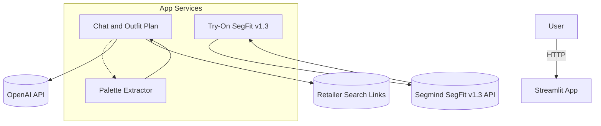
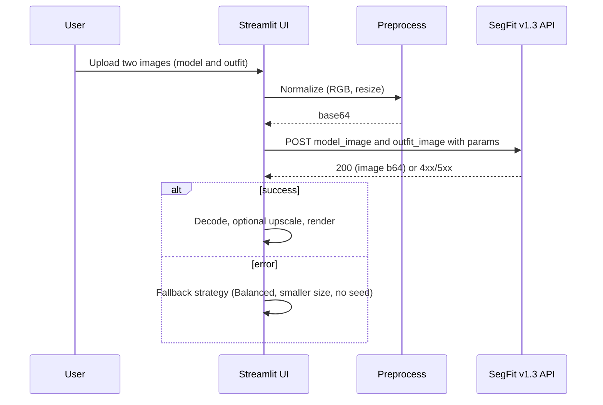
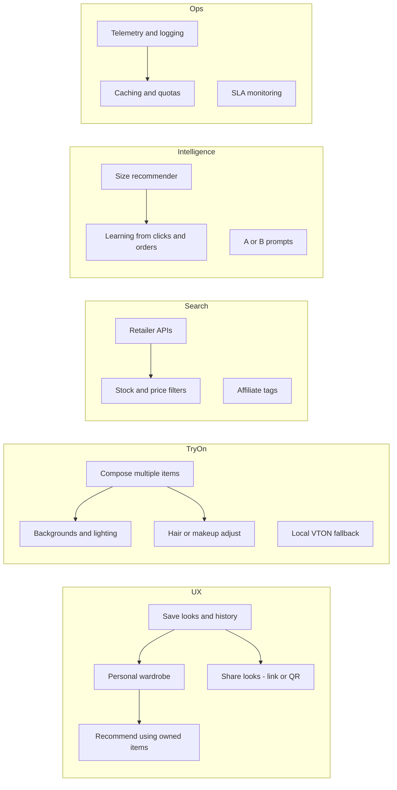

# AI Fashion Buddy — One-Pager (GitHub-safe v2)

**Live demo:** <https://ai-fashion-buddy-vsaggwpwtyk4cksgocqdsp.streamlit.app/TryOn_Segmind_API>  
**Repo:** <https://github.com/ElijahHoff/ai-fashion-buddy>

---

## High-Level Architecture

---

## Try-On Sequence (SegFit v1.3)

---

## Roadmap (Areas)

---

## Checklist
- [ ] Retailer APIs (size and stock filters)
- [ ] Size recommendations
- [ ] Save or share looks; try-on history
- [ ] Multi-item try-on (top, bottom, shoes)
- [ ] Local VTON backup path
- [ ] i18n (RU, EN, DE) and dark theme
- [ ] Metrics: retailer CTR, P95 to result, success rate
